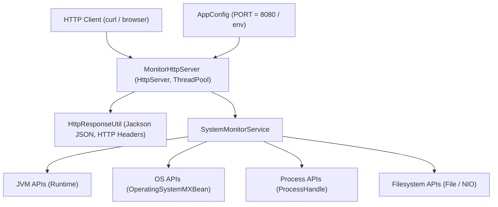
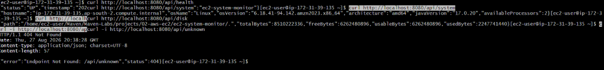

# EC2 System Monitor

A lightweight, zero-framework Java 17 HTTP monitoring service that runs directly on an AWS EC2 Linux instance and exposes structured system, JVM, process, CPU, memory, and filesystem metrics through a REST-style JSON HTTP API.

> **Note**: This is a hands-on learning project designed to explore lower-level Java, HTTP server, and JVM/OS integration mechanisms. It is **not** intended to replace enterprise monitoring platforms such as AWS CloudWatch, Prometheus, or Grafana.

---

## 1. Project Overview

`ec2-system-monitor` provides real-time system and runtime metrics for an AWS EC2 instance without relying on heavy web frameworks or external cloud SDKs. Built with standard Java 17 APIs, it exposes HTTP endpoints that return structured JSON metrics suitable for lightweight status checks and operational inspection.

---

## 2. Learning Objective

This project connects key software engineering and infrastructure concepts:

```text
Java 17 ──► Maven ──► JVM ──► Operating System ──► Filesystem ──► Process ──► HTTP ──► Linux ──► AWS EC2 ──► Git/GitHub
```

### Why Java's Built-in HTTP Server Was Used Instead of Spring Boot
Instead of adopting Spring Boot (which abstracts server startup, auto-configuration, and request mapping), this project uses `com.sun.net.httpserver.HttpServer`. Building the application using core Java standard libraries demonstrates what exists underneath Spring Boot before higher-level abstractions are introduced.

---

## 3. Technology Stack

- **Java Development Kit**: Java 17 (`OpenJDK 17.0.17` locally, `Amazon Corretto 17.0.20` on EC2)
- **Build Tool**: Apache Maven (`3.9.9` locally, `3.8.4` on EC2)
- **HTTP Server**: `com.sun.net.httpserver.HttpServer` (Java Standard Library)
- **JSON Serialization**: Jackson Databind (`com.fasterxml.jackson.core:jackson-databind:2.15.2`)
- **Unit Testing**: JUnit 5 (`org.junit.jupiter:junit-jupiter:5.10.0`)
- **Packaging Plugin**: Apache Maven Shade Plugin (`maven-shade-plugin:3.5.0`)
- **Target OS & Infrastructure**: Amazon Linux 2023 on AWS EC2 (`ap-south-2`)
- **Version Control**: Git `2.50.1` & GitHub

---

## 4. Architecture

The application follows a small, layered monolithic architecture where each component has a strict single responsibility:



### Layer Responsibilities:
- **`Application`**: Application entry point and JVM shutdown hook registration.
- **`AppConfig`**: Manages environment configuration (`PORT`) and fallback defaults.
- **`MonitorHttpServer`**: Handles HTTP server creation, route context registration, request dispatching, and thread pool execution.
- **`HttpResponseUtil`**: Centralized HTTP headers (`Content-Type: application/json`), Jackson JSON serialization, and error response formatting.
- **`SystemMonitorService`**: Core metric collection engine isolating system monitoring logic from HTTP transport.
- **`model`**: Immutable DTO data structures representing API payloads (`HealthResponse`, `SystemInfo`, `ResourceMetrics`, `DiskInfo`).

---

## 5. Project Structure

```text
ec2-system-monitor/
├── README.md
├── pom.xml
├── docs/
│   └── images/
│       └── ec2-api-verification.png
└── src/
    ├── main/
    │   └── java/
    │       └── com/
    │           └── shevay/
    │               └── monitor/
    │                   ├── Application.java
    │                   ├── config/
    │                   │   └── AppConfig.java
    │                   ├── model/
    │                   │   ├── DiskInfo.java
    │                   │   ├── HealthResponse.java
    │                   │   ├── ResourceMetrics.java
    │                   │   └── SystemInfo.java
    │                   ├── server/
    │                   │   ├── HttpResponseUtil.java
    │                   │   └── MonitorHttpServer.java
    │                   └── service/
    │                       └── SystemMonitorService.java
    └── test/
        └── java/
            └── com/
                └── shevay/
                    └── monitor/
                        ├── config/
                        │   └── AppConfigTest.java
                        ├── server/
                        │   └── MonitorHttpServerTest.java
                        └── service/
                            └── SystemMonitorServiceTest.java
```

### Understanding the Directory Layout:
- **Maven Directory Convention** (`src/main/java`, `src/test/java`): Enforces standardized build layout across all Java project tooling.
- **Java Package Hierarchy** (`com.shevay.monitor`): Prevents global namespace collisions and organizes source files into logical domains (`config`, `model`, `server`, `service`).
- **Application Architecture**: Dictates runtime dependency flow, separating concerns so the monitoring service does not depend on HTTP classes.

---

## 6. Maven Configuration

```xml
<groupId>com.shevay</groupId>
<artifactId>ec2-system-monitor</artifactId>
<version>1.0-SNAPSHOT</version>
<packaging>jar</packaging>
```

### Why Java 17 is Explicitly Configured
Legacy Maven archetypes often generated `pom.xml` configurations defaulting to Java 5 (`1.5`) source and target settings. Because modern Java compilers (JDK 12+) have retired support for Java 5 bytecode generation, attempting to build old archetypes on JDK 17 causes compiler failures (`Source option 5 is no longer supported`). 

`ec2-system-monitor` explicitly specifies `<maven.compiler.release>17</maven.compiler.release>` and uses `maven-compiler-plugin:3.11.0` to ensure clear, reproducible compilation under Java 17.

---

## 7. System Monitoring & Metrics Collection

Metric collection relies entirely on standard Java standard library APIs:

- **JVM Memory**: Collected via `Runtime.getRuntime()`. Tracks heap memory (`totalMemory`, `freeMemory`, `maxMemory`).
- **Operating System & CPU**: Collected via `java.lang.management.ManagementFactory.getOperatingSystemMXBean()`. Tracks OS name, version, architecture, available processors, system load average, and CPU load.
- **Process Information**: Collected via `java.lang.ProcessHandle.current()`. Captures process ID (`pid`) and process start time to compute process uptime.
- **Filesystem Space**: Collected via `java.io.File`. Reports total, free, usable, and used disk space for the application directory partition.

---

## 8. API Documentation

### 1. `GET /api/health`
- **Purpose**: Liveness check endpoint.
- **HTTP Method**: `GET`
- **Expected Status**: `200 OK`
- **`curl` Command**: `curl -i http://localhost:8080/api/health`
- **Example Response**:
```json
{
  "status": "UP",
  "timestamp": "2026-08-28T01:50:42.123456Z",
  "service": "ec2-system-monitor"
}
```

### 2. `GET /api/system`
- **Purpose**: Static system and runtime metadata.
- **HTTP Method**: `GET`
- **Expected Status**: `200 OK`
- **`curl` Command**: `curl -i http://localhost:8080/api/system`
- **Example Response**:
```json
{
  "hostname": "ip-172-31-39-135.ap-south-2.compute.internal",
  "osName": "Linux",
  "osVersion": "6.18.41-94.142.amzn2023.x86_64",
  "architecture": "amd64",
  "javaVersion": "17.0.20",
  "availableProcessors": 2
}
```

### 3. `GET /api/metrics`
- **Purpose**: Dynamic CPU, JVM heap memory, process PID, and uptime metrics.
- **HTTP Method**: `GET`
- **Expected Status**: `200 OK`
- **`curl` Command**: `curl -i http://localhost:8080/api/metrics`
- **Example Response**:
```json
{
  "systemCpuLoad": 0.05,
  "systemLoadAverage": 0.12,
  "jvmUsedMemoryBytes": 14680064,
  "jvmCommittedMemoryBytes": 33554432,
  "jvmMaxMemoryBytes": 536870912,
  "pid": 14205,
  "processUptimeSeconds": 3600
}
```

### 4. `GET /api/disk`
- **Purpose**: Storage disk space utilization for application partition.
- **HTTP Method**: `GET`
- **Expected Status**: `200 OK`
- **`curl` Command**: `curl -i http://localhost:8080/api/disk`
- **Example Response**:
```json
{
  "path": "/home/ec2-user/Maven/Maven-Labs/projects/01-aws-ec2/ec2-system-monitor/.",
  "totalBytes": 8510222336,
  "freeBytes": 6262480896,
  "usableBytes": 6262480896,
  "usedBytes": 2247741440
}
```

### Error Responses

#### `404 Not Found` (Unknown Endpoint)
- **`curl` Command**: `curl -i http://localhost:8080/api/unknown`
- **Response**:
```json
{
  "status": 404,
  "error": "Endpoint Not Found: /api/unknown"
}
```

#### `405 Method Not Allowed` (Unsupported HTTP Method)
- **`curl` Command**: `curl -i -X POST http://localhost:8080/api/health`
- **Response**:
```json
{
  "status": 405,
  "error": "Method Not Allowed. Only GET is supported."
}
```

---

## 9. Running Locally

```bash
# Verify environment
java -version
mvn -version

# Build executable shaded JAR
mvn clean package

# Run application locally
java -jar target/ec2-system-monitor-1.0-SNAPSHOT.jar

# Test in a separate terminal
curl http://localhost:8080/api/health
```

---

## 10. Running on AWS EC2

```bash
# Connect to EC2 instance and navigate to project directory
cd ~/Maven/Maven-Labs/projects/01-aws-ec2/ec2-system-monitor

# Build project on EC2
mvn clean package

# Start monitoring service
java -jar target/ec2-system-monitor-1.0-SNAPSHOT.jar

# Verify endpoints from a second SSH session
curl http://localhost:8080/api/health
curl http://localhost:8080/api/system
curl http://localhost:8080/api/metrics
curl http://localhost:8080/api/disk
```

---

## 11. EC2 Runtime Verification

The application was deployed, built, and executed directly on Amazon Linux 2023 inside AWS EC2 (`ap-south-2`). The image below shows the actual EC2 terminal session verifying API responses and 404 error handling:



*Caption: API endpoints `/api/health`, `/api/system`, `/api/disk`, and `/api/unknown` (404 Not Found) verified locally from an EC2 SSH session using curl.*

---

## 12. Configuration & Environment Overrides

Application configuration is managed centrally by `AppConfig.java`.

- **Default Port**: `8080`
- **Environment Variable Override**: `PORT`

### Custom Port Example:
```bash
PORT=9090 java -jar target/ec2-system-monitor-1.0-SNAPSHOT.jar

# Verify on custom port
curl http://localhost:9090/api/health
```

### Why Deployment Configuration Should Not Be Hardcoded:
Hardcoding ports or host settings prevents applications from adapting to container environments, cloud platform configurations, or local port conflicts without modifying source code and recompiling binaries.

---

## 13. Concurrency & Thread Pool Management

- **Bounded Thread Pool**: Configured with `Executors.newFixedThreadPool(10)` to manage HTTP client requests.
- **Controlled Resource Usage**: A bounded thread pool prevents resource exhaustion (such as out-of-memory errors caused by spawning an unlimited thread per request under high traffic).
- **Executor Shutdown**: Cleanly stops worker threads when the server halts to prevent unmanaged daemon threads from remaining active in the JVM.

---

## 14. Error Handling & Security

- **No Exposed Stack Traces**: Exceptions occurring during request processing are logged server-side via `java.util.logging.Logger`. Clients receive structured JSON error payloads (`404`, `405`, `500`).
- **Zero Command Execution**: Metric collection relies exclusively on standard Java library calls. The service does **not** invoke shell commands (`Runtime.exec` or `ProcessBuilder` are not used).
- **Path Parameter Input Restriction**: The service does not accept arbitrary filesystem path inputs from HTTP clients, preventing path traversal vulnerabilities.

---

## 15. Graceful Shutdown

The application registers a JVM shutdown hook (`Runtime.getRuntime().addShutdownHook`):

```java
Runtime.getRuntime().addShutdownHook(new Thread(() -> {
    LOGGER.info("Shutdown signal received. Stopping EC2 System Monitor...");
    server.stop();
}));
```

When `Ctrl+C` or a termination signal is sent to the process:
1. `HttpServer.stop(1)` halts incoming HTTP connections with a 1-second grace period.
2. The executor pool (`ExecutorService`) is shut down cleanly.
3. The process exits without leaving zombie worker threads.

---

## 16. Testing Strategy

The test suite includes 15 automated unit tests executed via `mvn test`:

- **`AppConfigTest`** (5 tests): Verifies default port fallback, custom `PORT` environment handling, invalid string parsing, and out-of-range port validation.
- **`SystemMonitorServiceTest`** (4 tests): Verifies environment-independent metric collection (hostname presence, positive processor counts, non-negative memory/disk values).
- **`MonitorHttpServerTest`** (6 tests): End-to-end HTTP integration tests verifying route matching (`/api/health`, `/api/system`, `/api/metrics`, `/api/disk`), HTTP 200 status codes, JSON serialization, 404 unknown routes, and 405 unsupported methods.

### Automated Tests vs. EC2 Manual Verification:
- **Automated Tests**: Assert functional logic, JSON serialization, and edge cases inside an isolated test environment.
- **EC2 Verification**: Confirms real-world deployment compatibility on Amazon Linux 2023 hardware and JVM configurations.

---

## 17. Build Artifact & Git Hygiene

Running `mvn clean package` generates an executable shaded JAR:

```text
target/ec2-system-monitor-1.0-SNAPSHOT.jar
```

The `target/` directory contains compiled bytecode and build outputs. It is strictly excluded from version control via `.gitignore`.

---

## 18. Security Considerations

- **No Authentication/Authorization**: Exposes public metrics without login headers. Access should be restricted at the network level.
- **AWS Security Group Best Practices**: HTTP port `8080` should **not** be open to `0.0.0.0/0`. Restrict inbound security group rules to specific admin IP addresses (`/32`) or access locally via SSH tunneling.
- **Educational Scope**: Intended for learning system monitoring concepts, not production enterprise deployment.

---

## 19. Architecture Design Decisions

| Design Choice | Rationale / Engineering Trade-off |
| :--- | :--- |
| **Java `HttpServer`** | Understand fundamental HTTP request/response handling without framework abstractions. |
| **Java Standard APIs** | Avoid external shell command dependencies (`df`, `top`) for reliability and security. |
| **Layered Packages** | Strict separation of concerns (transport, service logic, models, configuration). |
| **Jackson Library** | Fast, robust, standardized JSON object serialization. |
| **`PORT` Environment Config** | Flexible deployment configuration across local, container, and EC2 environments. |
| **Bounded Thread Pool** | Protect system memory and CPU against thread starvation under request spikes. |

---

## 20. Engineering Lessons Learned

1. **Maven Build Lifecycle**: How phases (`compile`, `test`, `package`) interact with plugins (`compiler`, `surefire`, `shade`).
2. **Java JDK vs. Project Target**: Why explicit target settings (`<release>17</release>`) are required under modern JDKs.
3. **HTTP Networking in Core Java**: Creating socket listeners, parsing request URIs, setting headers, and streaming response bytes.
4. **JVM vs. OS Metrics**: How to extract live CPU, heap memory, filesystem, and process telemetry directly from Java runtime interfaces.

---

## 21. Important Conceptual Distinctions

- **JVM Memory ≠ OS RAM**: `Runtime.getRuntime().maxMemory()` reports the maximum heap size allocated to the JVM, not total physical server RAM.
- **Process Uptime ≠ EC2 Instance Uptime**: `ProcessHandle.current().info().startInstant()` tracks Java application uptime, not total VM uptime since boot.
- **`localhost` Context**: `localhost` inside Windows terminal refers to the local machine; `localhost` inside EC2 SSH session refers to the AWS EC2 Linux virtual machine.
- **Maven Build Time ≠ Application Runtime**: Maven compiles and packages binaries during the build phase; the application executes independently via `java -jar`.

---

## 22. Limitations

- **Memory Context**: Measures JVM heap memory rather than total OS physical RAM.
- **CPU Platform Variations**: `systemCpuLoad` availability depends on underlying JVM OS management bean support.
- **No Persistence**: Metrics are real-time point-in-time snapshots; historical metrics are not persisted to a database.
- **Zero Authentication**: Designed strictly for internal/local learning use.

---

## 23. Conceptual Mapping to Spring Boot

| Core Java Implementation in `ec2-system-monitor` | Conceptual Equivalent in Spring Boot |
| :--- | :--- |
| `com.sun.net.httpserver.HttpServer` | Embedded Tomcat / Jetty (`spring-boot-starter-web`) |
| `AppConfig` | `@ConfigurationProperties` / `application.properties` |
| `HttpResponseUtil` + Jackson | `@RestController` + `@GetMapping` + Spring MVC MessageConverters |
| `SystemMonitorService` | `@Service` Spring Bean |
| `SystemMonitorServiceTest` | `@WebMvcTest` / `@SpringBootTest` |
| `/api/health` & `/api/metrics` | Spring Boot Actuator (`/actuator/health`, `/actuator/metrics`) |
