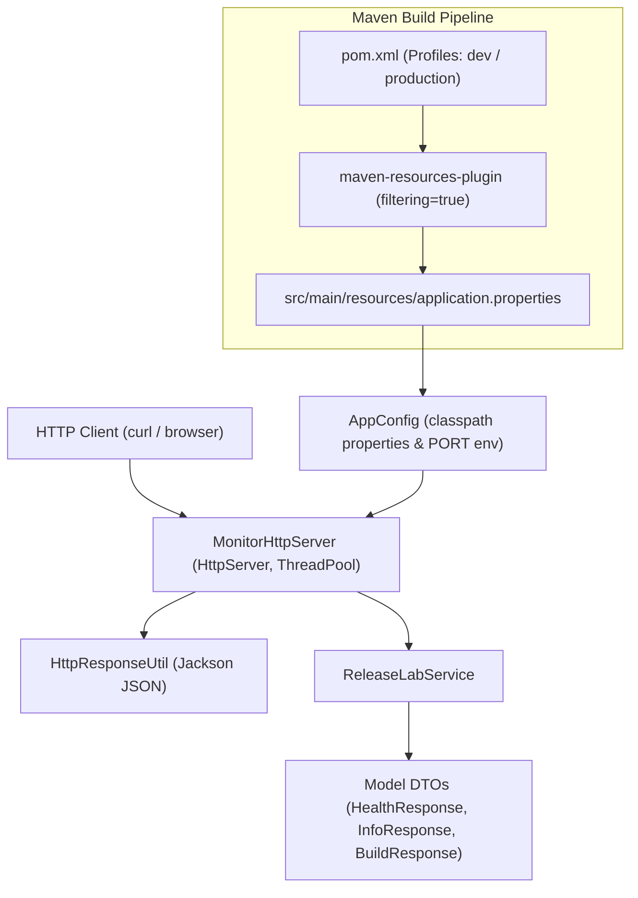

# Maven Release Lab

A lightweight, zero-framework Java 17 HTTP microservice laboratory designed to demonstrate Apache Maven build automation concepts, profile management, resource filtering, dependency scopes, transitive dependencies, plugin management, and AWS EC2 deployment.

---

## Purpose

`maven-release-lab` is the second project in the AWS EC2 laboratory (`projects/01-aws-ec2/maven-release-lab`). Its purpose is to make declarative Maven build automation mechanisms—such as environment profile switching, resource filtering, dependency scope isolation, and shaded fat-JAR packaging—observable at runtime through an executable Java service.

---

## Maven Concepts Demonstrated

1. **Declarative Coordinates**: `com.shevay:maven-release-lab:1.0.0`
2. **Java 17 Compiler Configuration**: Modern build targeting using `<maven.compiler.release>17</maven.compiler.release>`.
3. **Lifecycle Execution**: Phase processing (`validate`, `compile`, `test`, `package`, `verify`).
4. **Build Profiles**: Dynamic configuration switching (`-Pdev` vs. `-Pproduction`).
5. **Resource Filtering**: Injecting POM properties (`${project.artifactId}`, `${project.version}`, `${build.profile}`, `${build.environment}`) into `application.properties` during `process-resources`.
6. **Dependency Scopes**: Classpath isolation comparing `compile` scope (`jackson-databind`) against `test` scope (`junit-jupiter`).
7. **Transitive Dependencies**: Resolving downstream library graphs (`jackson-databind` → `jackson-core`, `jackson-annotations`).
8. **Plugin Goals**: Goal bindings for `compiler`, `resources`, `surefire`, `jar`, `shade`, and `dependency` plugins.
9. **Automated Testing**: Unit test execution via `maven-surefire-plugin` and JUnit 5.
10. **Packaging**: Standard bytecode archives vs. executable shaded fat JARs (`maven-shade-plugin`).
11. **Cloud Execution**: Deployment and runtime HTTP verification on Amazon Linux 2023.

---

## Architecture

The application relies on core Java 17 standard libraries (`com.sun.net.httpserver.HttpServer`) and Jackson JSON serialization:



---

## Project Structure

```text
maven-release-lab/
├── pom.xml                                    # Declarative build definition, profiles & plugins
├── README.md                                  # Project documentation & laboratory guide
└── src/
    ├── main/
    │   ├── java/
    │   │   └── com/shevay/releaselab/
    │   │       ├── Application.java           # Entry point & JVM shutdown hook
    │   │       ├── config/
    │   │       │   └── AppConfig.java         # Classpath properties loader & PORT resolver
    │   │       ├── model/                     # Immutable DTO payloads
    │   │       │   ├── BuildResponse.java
    │   │       │   ├── HealthResponse.java
    │   │       │   └── InfoResponse.java
    │   │       ├── server/                    # HTTP Server & Jackson serialization
    │   │       │   ├── HttpResponseUtil.java
    │   │       │   └── MonitorHttpServer.java
    │   │       └── service/
    │   │           └── ReleaseLabService.java # Business logic engine
    │   └── resources/
    │       └── application.properties        # Resource filtering property template
    │
    └── test/
        └── java/
            └── com/shevay/releaselab/
                ├── config/
                │   └── AppConfigTest.java     # Configuration & port parsing tests
                ├── server/
                │   └── MonitorHttpServerTest.java # HTTP handler integration tests
                └── service/
                    └── ReleaseLabServiceTest.java # Service payload unit tests
```

---

## Maven Configuration

```xml
<groupId>com.shevay</groupId>
<artifactId>maven-release-lab</artifactId>
<version>1.0.0</version>
<packaging>jar</packaging>

<properties>
    <maven.compiler.release>17</maven.compiler.release>
    <project.build.sourceEncoding>UTF-8</project.build.sourceEncoding>
    <jackson.version>2.15.2</jackson.version>
    <junit.version>5.10.0</junit.version>
</properties>
```

Using `<maven.compiler.release>17</maven.compiler.release>` configures `javac --release 17` to ensure source level, target bytecode version, and bootstrap classpath match Java 17.

---

## Build Profiles

The project configures two build profiles in `pom.xml`:

```xml
<profiles>
    <profile>
        <id>dev</id>
        <activation>
            <activeByDefault>true</activeByDefault>
        </activation>
        <properties>
            <build.profile>dev</build.profile>
            <build.environment>development</build.environment>
        </properties>
    </profile>
    <profile>
        <id>production</id>
        <properties>
            <build.profile>production</build.profile>
            <build.environment>production</build.environment>
        </properties>
    </profile>
</profiles>
```

- **Development Build**: `mvn clean package -Pdev` (Injects `build.profile=dev`, `build.environment=development`).
- **Production Build**: `mvn clean package -Pproduction` (Injects `build.profile=production`, `build.environment=production`).

---

## Resource Filtering

Resource filtering is configured in `pom.xml`:

```xml
<resources>
    <resource>
        <directory>src/main/resources</directory>
        <filtering>true</filtering>
    </resource>
</resources>
```

### Property Ingestion Pipeline

```text
1. Template Source (src/main/resources/application.properties)
   app.name=${project.artifactId}
   app.version=${project.version}
   app.profile=${build.profile}
   app.environment=${build.environment}
       │
       ▼ (maven-resources-plugin during process-resources phase)
2. Filtered Output (target/classes/application.properties)
   app.name=maven-release-lab
   app.version=1.0.0
   app.profile=production
   app.environment=production
       │
       ▼ (AppConfig loaded via ClassLoader at runtime)
3. HTTP Service Response (curl http://localhost:8080/api/build)
   {"application":"maven-release-lab","version":"1.0.0","buildProfile":"production","environment":"production"}
```

---

## Dependency Management

### Direct Compile Dependency
- `com.fasterxml.jackson.core:jackson-databind:2.15.2` (`compile` scope)

### Transitive Dependencies
- `com.fasterxml.jackson.core:jackson-annotations:2.15.2:compile`
- `com.fasterxml.jackson.core:jackson-core:2.15.2:compile`

### Test Dependencies
- `org.junit.jupiter:junit-jupiter-api:5.10.0` (`test` scope)
- `org.junit.jupiter:junit-jupiter-engine:5.10.0` (`test` scope)

### Verified Dependency Tree (`mvn dependency:tree`)
```text
[INFO] com.shevay:maven-release-lab:jar:1.0.0
[INFO] +- com.fasterxml.jackson.core:jackson-databind:jar:2.15.2:compile
[INFO] |  +- com.fasterxml.jackson.core:jackson-annotations:jar:2.15.2:compile
[INFO] |  \- com.fasterxml.jackson.core:jackson-core:jar:2.15.2:compile
[INFO] +- org.junit.jupiter:junit-jupiter-api:jar:5.10.0:test
[INFO] |  +- org.opentest4j:opentest4j:jar:1.3.0:test
[INFO] |  +- org.junit.platform:junit-platform-commons:jar:1.10.0:test
[INFO] |  \- org.apiguardian:apiguardian-api:jar:1.1.2:test
[INFO] \- org.junit.jupiter:junit-jupiter-engine:jar:5.10.0:test
```

---

## Plugin Configuration

| Lifecycle Phase | Bound Plugin Goal | Function |
| :--- | :--- | :--- |
| `validate` | `maven-plugin-api` | Validates POM schema & project metadata. |
| `process-resources` | `maven-resources-plugin:resources` | Copies resources and performs POM property substitution. |
| `compile` | `maven-compiler-plugin:compile` | Compiles application Java sources using `javac --release 17`. |
| `test-compile` | `maven-compiler-plugin:testCompile` | Compiles test sources in `src/test/java`. |
| `test` | `maven-surefire-plugin:test` | Runs JUnit 5 test suites. |
| `package` | `maven-jar-plugin:jar` | Packages compiled bytecode into standard JAR archive. |
| `package` | `maven-shade-plugin:shade` | Bundles project classes and runtime dependencies into executable fat JAR. |

---

## Testing

Automated tests are executed via `maven-surefire-plugin:3.1.2`:

```text
[INFO] Running com.shevay.releaselab.config.AppConfigTest
[INFO] Tests run: 4, Failures: 0, Errors: 0, Skipped: 0, Time elapsed: 0.045 s
[INFO] Running com.shevay.releaselab.service.ReleaseLabServiceTest
[INFO] Tests run: 3, Failures: 0, Errors: 0, Skipped: 0, Time elapsed: 0.012 s
[INFO] Running com.shevay.releaselab.server.MonitorHttpServerTest
[INFO] Tests run: 5, Failures: 0, Errors: 0, Skipped: 0, Time elapsed: 0.380 s
[INFO] 
[INFO] Results:
[INFO] 
[INFO] Tests run: 12, Failures: 0, Errors: 0, Skipped: 0
```

- **Total Tests**: 12
- **Passed**: 12
- **Failures**: 0
- **Errors**: 0
- **Skipped**: 0

---

## Packaging

Executing `mvn clean package` produces two artifacts in `target/`:

1. **`target/maven-release-lab-1.0.0.jar`** (Executable Shaded Fat JAR):
   - Produced by `maven-shade-plugin:3.5.0`.
   - Replaces the default primary artifact.
   - Contains application classes (`com/shevay/releaselab/`) and Jackson runtime dependencies (`com/fasterxml/jackson/`).
   - Declares `Main-Class: com.shevay.releaselab.Application` in `META-INF/MANIFEST.MF`.
2. **`target/original-maven-release-lab-1.0.0.jar`** (Unshaded Original Bytecode Archive):
   - Created by `maven-jar-plugin:3.3.0` and preserved separately by the Shade plugin.
   - Contains only project bytecode and resources without third-party dependencies.

> [!NOTE]
> The Shade plugin replaces `target/maven-release-lab-1.0.0.jar` with the final shaded fat JAR. No file named `maven-release-lab-1.0.0-shaded.jar` is generated.

---

## AWS EC2 Deployment

### Verified Environment
- **Platform**: AWS EC2 (`ap-south-2`, Amazon Linux 2023 `6.18.41-94.142.amzn2023.x86_64`)
- **JDK Runtime**: Amazon Corretto 17.0.20
- **Build Tool**: Apache Maven 3.8.4

### Execution Commands
```bash
cd ~/Maven/Maven-Labs/projects/01-aws-ec2/maven-release-lab
mvn clean package -Pproduction
java -jar target/maven-release-lab-1.0.0.jar
```

---

## API Reference

### 1. `GET /api/health`
```http
HTTP/1.1 200 OK
Content-Type: application/json; charset=UTF-8

{"status":"UP"}
```

### 2. `GET /api/info`
```http
HTTP/1.1 200 OK
Content-Type: application/json; charset=UTF-8

{"application":"maven-release-lab","version":"1.0.0","environment":"production","javaVersion":"17.0.20","operatingSystem":"Linux"}
```

### 3. `GET /api/build` (Production Profile)
```http
HTTP/1.1 200 OK
Content-Type: application/json; charset=UTF-8

{"application":"maven-release-lab","version":"1.0.0","buildProfile":"production","environment":"production"}
```

### 4. `GET /api/build` (Development Profile)
```http
HTTP/1.1 200 OK
Content-Type: application/json; charset=UTF-8

{"application":"maven-release-lab","version":"1.0.0","buildProfile":"dev","environment":"development"}
```

### 5. Error Routes
- **`GET /api/unknown`**: Returns `404 Not Found` (`{"status":404,"error":"Endpoint Not Found: /api/unknown"}`).
- **`POST /api/health`**: Returns `405 Method Not Allowed` (`{"status":405,"error":"Method Not Allowed. Only GET is supported."}`).

### EC2 Terminal Session Verification


*API endpoints `/api/health`, `/api/info`, `/api/build`, `/api/unknown` (404), and `POST /api/health` (405) verified live on AWS EC2 using curl.*

---

## Verification Results

| Lifecycle Command | Result | Notes |
| :--- | :--- | :--- |
| `mvn clean validate` | **BUILD SUCCESS** | Validated POM schema & project metadata on EC2 |
| `mvn clean compile` | **BUILD SUCCESS** | Compiled main Java sources using javac --release 17 |
| `mvn clean test` | **BUILD SUCCESS** | Executed 12 Surefire unit tests (0 failures, 0 errors) |
| `mvn clean package` | **BUILD SUCCESS** | Built standard JAR and shaded executable fat JAR |
| `mvn clean verify` | **BUILD SUCCESS** | Verified build integrity and artifact packaging |

---

## Troubleshooting

### Operational Port Conflict (`BindException`)
During initial service startup on EC2, the process encountered:
```text
java.net.BindException: Address already in use
```
- **Diagnostic Commands**:
  ```bash
  ss -ltnp | grep ':8080'
  sudo lsof -i :8080
  ```
- **Resolution**: Identified stale Java process PID `7357` occupying port `8080` and terminated it (`kill -9 7357`). The service subsequently bound to port `8080` successfully.

---

## Known Build Warnings

1. **Shade Overlapping Resource Warnings**: `maven-shade-plugin:3.5.0` emitted non-fatal warnings regarding overlapping `META-INF/MANIFEST.MF`, `LICENSE`, `NOTICE`, and `module-info.class` files across Jackson dependencies.
2. **Resource Encoding Warning**: Maven logged a notification that encoding was not explicitly configured for resource filtering (`Using platform encoding UTF-8`).

---

## Engineering Notes

1. **Profile Isolation**: Profiles separate environment configuration from source code, enabling build-time dynamic injection.
2. **Resource Filtering Mechanics**: Property placeholders inside resources are substituted during the `process-resources` phase before packaging.
3. **Dependency Graph Auditing**: Executing `mvn dependency:tree` allows inspecting direct vs. transitive dependencies and verifying scope isolation.
4. **Shaded Fat JAR Packaging**: The `maven-shade-plugin` combines application classes and runtime dependencies into a single executable archive suitable for cloud deployment.

---

## Status

**Status**: `Verified on AWS EC2`
