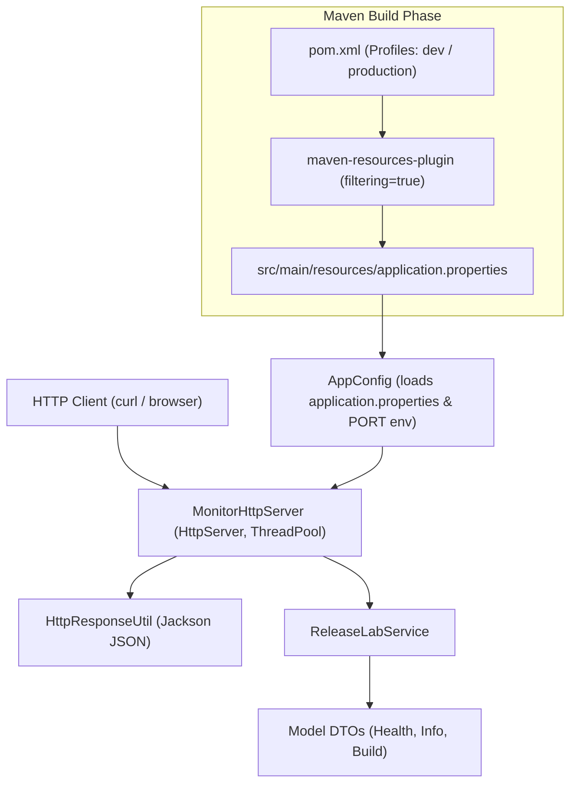

# Maven Release Lab

A lightweight, zero-framework Java 17 HTTP microservice laboratory designed to demonstrate advanced Apache Maven build automation concepts, profile management, resource filtering, dependency scopes, transitive dependencies, and AWS EC2 deployment.

---

## 1. Project Overview

`maven-release-lab` is the second project in the `Maven-Labs` series. While Project 1 (`ec2-system-monitor`) focused on Java HTTP networking and system monitoring, `maven-release-lab` focuses specifically on making **Apache Maven build automation mechanisms** observable at runtime.

The application exposes structured HTTP JSON endpoints (`/api/health`, `/api/info`, `/api/build`) whose metadata is dynamically injected by Apache Maven during compilation and packaging based on the active build profile (`dev` vs. `production`).

---

## 2. Learning Objectives

This project provides hands-on, practical demonstration of key Maven engineering concepts:

1. **Maven Profiles**: Environment-specific configuration switching (`-Pdev` vs. `-Pproduction`).
2. **Resource Filtering**: Injecting Maven POM properties (`${project.artifactId}`, `${project.version}`, `${build.profile}`) into `application.properties`.
3. **Dependency Scopes**: Distinguishing runtime/compile dependencies (`jackson-databind`) from test-scoped dependencies (`junit-jupiter`).
4. **Transitive Dependencies**: Inspecting direct dependencies that automatically pull required downstream libraries.
5. **Dependency Tree Inspection**: Analyzing artifact relationships using `mvn dependency:tree`.
6. **Plugin Configuration**: Binding goals from `compiler`, `resources`, `surefire`, `jar`, `shade`, and `dependency` plugins to lifecycle phases.
7. **Packaging Architecture**: Comparing standard compiled class JARs against executable fat/shaded JARs.
8. **Automated Testing**: Unit test execution via `maven-surefire-plugin` and JUnit 5.
9. **Cloud Deployment**: Packaging a production profile binary and executing it on AWS EC2 Linux.

---

## 3. Architecture

The application follows a lightweight, layered architecture with zero heavy web framework dependencies:



---

## 4. Project Structure

```text
maven-release-lab/
├── pom.xml                                    # Maven POM configuration with profiles & plugins
├── README.md                                  # Project documentation & laboratory guide
└── src/
    ├── main/
    │   ├── java/
    │   │   └── com/shevay/releaselab/
    │   │       ├── Application.java           # Entry point & JVM shutdown hook
    │   │       ├── config/
    │   │       │   └── AppConfig.java         # Classpath properties & PORT resolver
    │   │       ├── model/                     # Immutable DTOs
    │   │       │   ├── BuildResponse.java
    │   │       │   ├── HealthResponse.java
    │   │       │   └── InfoResponse.java
    │   │       ├── server/                    # HTTP Server & Jackson JSON serialization
    │   │       │   ├── HttpResponseUtil.java
    │   │       │   └── MonitorHttpServer.java
    │   │       └── service/
    │   │           └── ReleaseLabService.java # Business logic engine
    │   └── resources/
    │       └── application.properties        # Maven resource filtering template
    │
    └── test/
        └── java/
            └── com/shevay/releaselab/
                ├── config/
                │   └── AppConfigTest.java     # Config & port validation tests
                ├── server/
                │   └── MonitorHttpServerTest.java # Integration HTTP endpoint tests
                └── service/
                    └── ReleaseLabServiceTest.java # Service layer unit tests
```

---

## 5. Core Maven Concepts Demonstrated

### A. Dependency Scopes
Dependencies in `pom.xml` use distinct scopes to control classpath visibility:
- **`compile` (default)**: `com.fasterxml.jackson.core:jackson-databind:2.15.2` is required at compile time, packaged into the shaded JAR, and present at runtime.
- **`test`**: `org.junit.jupiter:junit-jupiter-api:5.10.0` is available strictly during `mvn test` execution and excluded from production runtime archives.

### B. Resource Filtering
The `maven-resources-plugin` scans files in `src/main/resources/` during the `process-resources` phase and substitutes `${...}` placeholders with active Maven properties before outputting them to `target/classes/application.properties`.

---

## 6. Maven Profiles

The project defines two build profiles in `pom.xml`:

```xml
<profiles>
    <profile>
        <id>dev</id>
        <activation>
            <activeByDefault>true</activeByDefault>
        </activation>
        <properties>
            <build.profile>dev</build.profile>
            <build.environment>development</build.environment>
        </properties>
    </profile>
    <profile>
        <id>production</id>
        <properties>
            <build.profile>production</build.profile>
            <build.environment>production</build.environment>
        </properties>
    </profile>
</profiles>
```

### Build Commands:

#### 1. Development Build (Default Profile)
```bash
mvn clean package -Pdev
```
Injects `build.profile=dev` and `build.environment=development` into `application.properties`.

#### 2. Production Build
```bash
mvn clean package -Pproduction
```
Injects `build.profile=production` and `build.environment=production` into `application.properties`.

---

## 7. Resource Filtering Execution Flow

```text
pom.xml (active profile: production)
       │
       ▼
maven-resources-plugin (filtering=true)
       │
       ▼
src/main/resources/application.properties
  app.name=${project.artifactId}    ──►  maven-release-lab
  app.version=${project.version}   ──►  1.0.0
  app.profile=${build.profile}     ──►  production
  app.environment=${build.environment} ──► production
       │
       ▼
target/classes/application.properties (Filtered Runtime File)
       │
       ▼
AppConfig.java (loaded via ClassLoader at runtime)
       │
       ▼
GET /api/build  ──►  {"application":"maven-release-lab","version":"1.0.0","buildProfile":"production","environment":"production"}
```

---

## 8. Dependency Tree Analysis

Executing the dependency tree command:

```bash
mvn dependency:tree
```

Produces the following hierarchy:

```text
[INFO] com.shevay:maven-release-lab:jar:1.0.0
[INFO] +- com.fasterxml.jackson.core:jackson-databind:jar:2.15.2:compile
[INFO] |  +- com.fasterxml.jackson.core:jackson-annotations:jar:2.15.2:compile
[INFO] |  \- com.fasterxml.jackson.core:jackson-core:jar:2.15.2:compile
[INFO] +- org.junit.jupiter:junit-jupiter-api:jar:5.10.0:test
[INFO] |  +- org.opentest4j:opentest4j:jar:1.3.0:test
[INFO] |  +- org.junit.platform:junit-platform-commons:jar:1.10.0:test
[INFO] |  \- org.apiguardian:apiguardian-api:jar:1.1.2:test
[INFO] \- org.junit.jupiter:junit-jupiter-engine:jar:5.10.0:test
```

### Transitive Dependency Key Takeaways:
1. **Direct Dependency**: Declaring `jackson-databind` automatically pulls `jackson-annotations` and `jackson-core` without requiring explicit declarations in `pom.xml`.
2. **Scope Propagation**: Transitive dependencies inherited from `jackson-databind` retain the `compile` scope.
3. **Test Isolation**: JUnit dependencies and their transitive children (`opentest4j`, `apiguardian-api`) are scoped exclusively to `test`.

---

## 9. Build Lifecycles & Plugin Goals

| Lifecycle Phase | Bound Plugin Goal | Description |
| :--- | :--- | :--- |
| `validate` | `maven-plugin-api` | Validates project structure and POM correctness. |
| `process-resources` | `maven-resources-plugin:resources` | Copies resources to `target/classes` and applies property filtering. |
| `compile` | `maven-compiler-plugin:compile` | Compiles Java source files using `javac` with `--release 17`. |
| `test-compile` | `maven-compiler-plugin:testCompile` | Compiles unit test sources located in `src/test/java`. |
| `test` | `maven-surefire-plugin:test` | Executes JUnit 5 unit test suites and generates execution reports. |
| `package` | `maven-jar-plugin:jar` | Packages compiled bytecode into a standard JAR (`maven-release-lab-1.0.0.jar`). |
| `package` | `maven-shade-plugin:shade` | Bundles application bytecode + Jackson dependencies into an executable fat JAR. |

---

## 10. Packaging: Standard JAR vs. Executable Shaded JAR

### Standard JAR (`maven-jar-plugin`)
Contains only project compiled bytecode (`.class` files) and filtered resources (`application.properties`). Executing `java -jar` against a standard JAR fails with `NoMainClass` or `ClassNotFoundException` due to missing third-party libraries.

### Executable Shaded Fat JAR (`maven-shade-plugin`)
Bundles project classes, filtered resources, **plus all transitive runtime dependencies** (`jackson-databind`, `jackson-core`, `jackson-annotations`) into a single standalone archive. Configures the `Main-Class` manifest header:

```xml
<transformer implementation="org.apache.maven.plugins.shade.resource.ManifestResourceTransformer">
    <mainClass>com.shevay.releaselab.Application</mainClass>
</transformer>
```

---

## 11. Automated Testing Strategy

The project includes an automated test suite executed via `maven-surefire-plugin` (`mvn test`):

- **`AppConfigTest`** (4 tests): Verifies property loading from classpath, custom properties overrides, `PORT` environment variable resolution, and fallback invalid port handling.
- **`ReleaseLabServiceTest`** (3 tests): Verifies response payload generation for `getHealth()`, `getInfo()`, and `getBuild()`.
- **`MonitorHttpServerTest`** (5 tests): End-to-end HTTP integration tests against active endpoints (`/api/health`, `/api/info`, `/api/build`), 404 unknown routes, and 405 unsupported HTTP method handling.

---

## 12. AWS EC2 Deployment Workflow

### 1. Connect to AWS EC2 Instance
```bash
ssh -i "java.pem" ec2-user@ec2-16-113-88-194.ap-south-2.compute.amazonaws.com
```

### 2. Navigate to Project & Build Production Profile
```bash
cd ~/Maven/projects/01-aws-ec2/maven-release-lab
mvn clean package -Pproduction
```

### 3. Run Executable Shaded JAR
```bash
java -jar target/maven-release-lab-1.0.0.jar
```

### 4. Custom Port Override Example
```bash
PORT=9090 java -jar target/maven-release-lab-1.0.0.jar
```

---

## 13. API Endpoint Verification & Expected Outputs

### 1. `GET /api/health`
```bash
curl -i http://localhost:8080/api/health
```
```json
{
  "status": "UP"
}
```

### 2. `GET /api/info`
```bash
curl -i http://localhost:8080/api/info
```
```json
{
  "application": "maven-release-lab",
  "version": "1.0.0",
  "environment": "production",
  "javaVersion": "17.0.20",
  "operatingSystem": "Linux"
}
```

### 3. `GET /api/build`
```bash
curl -i http://localhost:8080/api/build
```
```json
{
  "application": "maven-release-lab",
  "version": "1.0.0",
  "buildProfile": "production",
  "environment": "production"
}
```

### 4. Error Responses

#### Endpoint Not Found (`404`)
```bash
curl -i http://localhost:8080/api/unknown
```
```json
{
  "status": 404,
  "error": "Endpoint Not Found: /api/unknown"
}
```

#### Method Not Allowed (`405`)
```bash
curl -i -X POST http://localhost:8080/api/health
```
```json
{
  "status": 405,
  "error": "Method Not Allowed. Only GET is supported."
}
```

---

## 14. Key Engineering Lessons Learned

1. **Maven Profiles**: How build profiles enable dynamic configuration switching for different environments without altering source code.
2. **Resource Filtering Mechanics**: How Maven replaces POM properties inside resources during the `process-resources` phase.
3. **Classpath Isolation**: Why `test` scope prevents test framework code from leaking into production runtime JARs.
4. **Transitive Dependency Management**: How Maven automatically resolves dependency graphs and how `mvn dependency:tree` simplifies dependency auditing.
5. **Fat JAR Packaging**: Why `maven-shade-plugin` is required to create self-contained executable JARs for cloud deployments.
