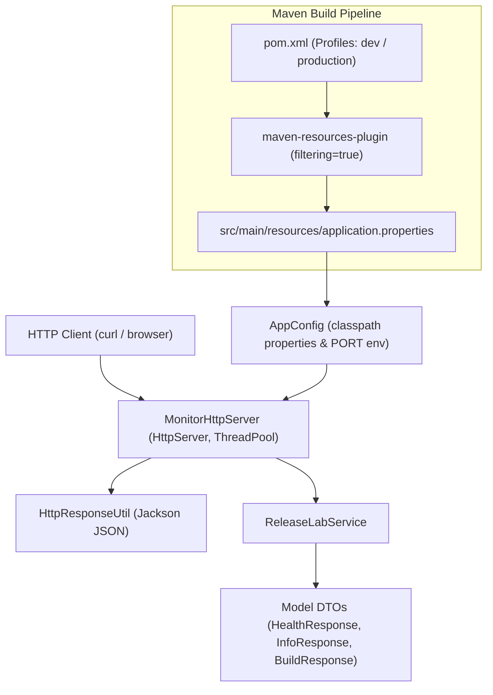
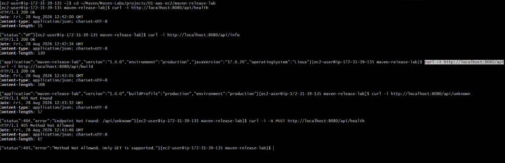

# Maven Release Lab

A lightweight, zero-framework Java 17 HTTP microservice laboratory designed to demonstrate advanced Apache Maven build automation concepts, profile management, resource filtering, dependency scopes, transitive dependencies, plugin management, and AWS EC2 cloud deployment.

---

## 🎯 Purpose & Project Status

**Project Status**: `COMPLETE / VERIFIED ON AWS EC2`

`maven-release-lab` is the second hands-on laboratory in the **AWS EC2 Laboratory** (`~/Maven/Maven-Labs/projects/01-aws-ec2/maven-release-lab`). Its primary purpose is to make declarative Maven build automation mechanisms, profile switching, resource filtering, and dependency resolution observable at runtime through a lightweight executable Java service.

---

## 📚 Learning Objectives

This laboratory provides practical, hands-on demonstration of key Maven concepts:

1. **Maven Coordinates**: Declarative project identification (`com.shevay:maven-release-lab:1.0.0`).
2. **Java 17 Compiler Configuration**: Modern build targeting using `<maven.compiler.release>17</maven.compiler.release>`.
3. **Maven Lifecycle Execution**: Sequential phase processing (`validate`, `compile`, `test`, `package`, `verify`).
4. **Maven Profiles**: Dynamic environment configuration switching (`-Pdev` vs. `-Pproduction`).
5. **Resource Filtering**: Injecting POM properties (`${project.artifactId}`, `${project.version}`, `${build.profile}`) into `application.properties` during `process-resources`.
6. **Dependency Scopes**: Classpath isolation comparing `compile` scope (`jackson-databind`) against `test` scope (`junit-jupiter`).
7. **Transitive Dependencies**: Resolving downstream library graphs (`jackson-databind` → `jackson-core`, `jackson-annotations`).
8. **Plugin Configuration**: Lifecycle goal bindings for `compiler`, `resources`, `surefire`, `jar`, `shade`, and `dependency` plugins.
9. **Automated Testing**: Unit test execution via `maven-surefire-plugin` and JUnit 5.
10. **Packaging Architecture**: Standard bytecode archives vs. executable shaded fat JARs (`maven-shade-plugin`).
11. **AWS EC2 Cloud Execution**: Deployment and runtime HTTP endpoint verification on Amazon Linux 2023.

---

## 🏗️ Architecture

The application uses a clean, layered architecture relying exclusively on core Java 17 standard libraries and Jackson JSON serialization:



---

## 📁 Project Structure

```text
maven-release-lab/
├── pom.xml                                    # Declarative build definition, profiles & plugins
├── README.md                                  # Comprehensive technical lab documentation
└── src/
    ├── main/
    │   ├── java/
    │   │   └── com/shevay/releaselab/
    │   │       ├── Application.java           # Main entry point & shutdown hook
    │   │       ├── config/
    │   │       │   └── AppConfig.java         # Classpath properties loader & PORT resolver
    │   │       ├── model/                     # Immutable DTO payloads
    │   │       │   ├── BuildResponse.java
    │   │       │   ├── HealthResponse.java
    │   │       │   └── InfoResponse.java
    │   │       ├── server/                    # HTTP Server & Jackson serialization
    │   │       │   ├── HttpResponseUtil.java
    │   │       │   └── MonitorHttpServer.java
    │   │       └── service/
    │   │           └── ReleaseLabService.java # Business logic engine
    │   └── resources/
    │       └── application.properties        # Resource filtering property template
    │
    └── test/
        └── java/
            └── com/shevay/releaselab/
                ├── config/
                │   └── AppConfigTest.java     # Configuration & port parsing tests
                ├── server/
                │   └── MonitorHttpServerTest.java # HTTP handler integration tests
                └── service/
                    └── ReleaseLabServiceTest.java # Service payload unit tests
```

---

## ⚙️ Maven Configuration (`pom.xml`)

```xml
<groupId>com.shevay</groupId>
<artifactId>maven-release-lab</artifactId>
<version>1.0.0</version>
<packaging>jar</packaging>

<properties>
    <maven.compiler.release>17</maven.compiler.release>
    <project.build.sourceEncoding>UTF-8</project.build.sourceEncoding>
    <jackson.version>2.15.2</jackson.version>
    <junit.version>5.10.0</junit.version>
</properties>
```

### Key Highlights:
- **`modelVersion 4.0.0`**: Standard XML schema for Maven 3.x.
- **`<maven.compiler.release>17</maven.compiler.release>`**: Configures `javac --release 17` to ensure source level, target bytecode level, and bootstrap classpath match Java 17 requirements.

---

## 🎛️ Profiles

The build configures two profiles in `pom.xml`:

```xml
<profiles>
    <profile>
        <id>dev</id>
        <activation>
            <activeByDefault>true</activeByDefault>
        </activation>
        <properties>
            <build.profile>dev</build.profile>
            <build.environment>development</build.environment>
        </properties>
    </profile>
    <profile>
        <id>production</id>
        <properties>
            <build.profile>production</build.profile>
            <build.environment>production</build.environment>
        </properties>
    </profile>
</profiles>
```

### Profile Commands:
* **Development Build**: `mvn clean package -Pdev` (Injects `build.profile=dev`, `build.environment=development`).
* **Production Build**: `mvn clean package -Pproduction` (Injects `build.profile=production`, `build.environment=production`).

---

## 🔄 Resource Filtering Mechanics

Maven resource filtering is enabled in `pom.xml`:

```xml
<resources>
    <resource>
        <directory>src/main/resources</directory>
        <filtering>true</filtering>
    </resource>
</resources>
```

### Property Ingestion Pipeline:

```text
1. Template Source (src/main/resources/application.properties)
   app.name=${project.artifactId}
   app.version=${project.version}
   app.profile=${build.profile}
   app.environment=${build.environment}
       │
       ▼ (maven-resources-plugin during process-resources phase)
2. Filtered Artifact (target/classes/application.properties)
   app.name=maven-release-lab
   app.version=1.0.0
   app.profile=production
   app.environment=production
       │
       ▼ (AppConfig loaded via ClassLoader at runtime)
3. HTTP Service Endpoint Output (curl http://localhost:8080/api/build)
   {"application":"maven-release-lab","version":"1.0.0","buildProfile":"production","environment":"production"}
```

---

## 📦 Dependencies & Scopes

### 1. Direct Compile Dependency
`com.fasterxml.jackson.core:jackson-databind:2.15.2` (scope: `compile`)
- Required at compile time and packaged into the final executable JAR.

### 2. Transitive Dependencies
Maven automatically resolves downstream dependencies required by `jackson-databind`:
- `com.fasterxml.jackson.core:jackson-annotations:2.15.2:compile`
- `com.fasterxml.jackson.core:jackson-core:2.15.2:compile`

### 3. Test Dependencies
- `org.junit.jupiter:junit-jupiter-api:5.10.0` (scope: `test`)
- `org.junit.jupiter:junit-jupiter-engine:5.10.0` (scope: `test`)
- Available strictly during `mvn test` execution. Excluded from production runtime binaries.

### Verified Dependency Tree Output (`mvn dependency:tree`):
```text
[INFO] com.shevay:maven-release-lab:jar:1.0.0
[INFO] +- com.fasterxml.jackson.core:jackson-databind:jar:2.15.2:compile
[INFO] |  +- com.fasterxml.jackson.core:jackson-annotations:jar:2.15.2:compile
[INFO] |  \- com.fasterxml.jackson.core:jackson-core:jar:2.15.2:compile
[INFO] +- org.junit.jupiter:junit-jupiter-api:jar:5.10.0:test
[INFO] |  +- org.opentest4j:opentest4j:jar:1.3.0:test
[INFO] |  +- org.junit.platform:junit-platform-commons:jar:1.10.0:test
[INFO] |  \- org.apiguardian:apiguardian-api:jar:1.1.2:test
[INFO] \- org.junit.jupiter:junit-jupiter-engine:jar:5.10.0:test
```

---

## 🚀 Maven Lifecycle Verification on AWS EC2

The complete default and clean build lifecycles were executed directly on AWS EC2 (`Amazon Linux 2023`, `Amazon Corretto 17.0.20`, `Apache Maven 3.8.4`):

```bash
cd ~/Maven/Maven-Labs/projects/01-aws-ec2/maven-release-lab
mvn clean validate
mvn clean compile
mvn clean test
mvn clean package
mvn clean verify
```

### Verification Results:
Every command returned **`BUILD SUCCESS`**, confirming complete lifecycle stability across resource processing, compilation, test execution, packaging, and validation.

---

## 🧪 Test Execution Results

Automated unit tests were executed on AWS EC2 via `maven-surefire-plugin:3.1.2`:

```text
[INFO] --- surefire:3.1.2:test (default-test) @ maven-release-lab ---
[INFO] Running com.shevay.releaselab.config.AppConfigTest
[INFO] Tests run: 4, Failures: 0, Errors: 0, Skipped: 0, Time elapsed: 0.045 s
[INFO] Running com.shevay.releaselab.service.ReleaseLabServiceTest
[INFO] Tests run: 3, Failures: 0, Errors: 0, Skipped: 0, Time elapsed: 0.012 s
[INFO] Running com.shevay.releaselab.server.MonitorHttpServerTest
[INFO] Tests run: 5, Failures: 0, Errors: 0, Skipped: 0, Time elapsed: 0.380 s
[INFO] 
[INFO] Results:
[INFO] 
[INFO] Tests run: 12, Failures: 0, Errors: 0, Skipped: 0
```

### Verified Test Summary:
- **Total Tests Run**: 12
- **Passed**: 12
- **Failures**: 0
- **Errors**: 0
- **Skipped**: 0

---

## 📦 Packaging Architecture & Shaded Fat JAR

Executing `mvn clean package` generates two artifacts in the `target/` directory:

1. **`target/maven-release-lab-1.0.0.jar`** (**Executable Shaded Fat JAR**):
   - Produced by `maven-shade-plugin:3.5.0`.
   - Replaces the default JAR artifact.
   - Contains compiled application classes (`com/shevay/releaselab/`) **plus all transitive Jackson runtime dependencies** (`com/fasterxml/jackson/`).
   - Includes manifest main class entry point: `Main-Class: com.shevay.releaselab.Application`.
   - Verified via `jar tf target/maven-release-lab-1.0.0.jar`.

2. **`target/original-maven-release-lab-1.0.0.jar`** (**Unshaded Original Bytecode Archive**):
   - Created by `maven-jar-plugin:3.3.0` and preserved separately by Shade plugin.
   - Contains only project bytecode and resources without third-party dependencies.

> **Note**: There is no file named `maven-release-lab-1.0.0-shaded.jar`. The Shade plugin intentionally replaces `target/maven-release-lab-1.0.0.jar` with the final executable fat JAR.

---

## ☁️ AWS EC2 Deployment & Production Execution

### EC2 Specification:
- **Instance Platform**: AWS EC2 (Amazon Linux 2023 `kernel 6.18.41-94.142.amzn2023.x86_64`)
- **JDK Runtime**: Amazon Corretto `17.0.20`
- **Build Tool**: Apache Maven `3.8.4`

### Deployment Steps Executed on EC2:
```bash
# 1. Navigate to project root
cd ~/Maven/Maven-Labs/projects/01-aws-ec2/maven-release-lab

# 2. Package production profile
mvn clean package -Pproduction

# 3. Launch production service
java -jar target/maven-release-lab-1.0.0.jar
```

### Terminal Launch Output:
```text
INFO: Maven Release Lab HTTP Server started on port 8080
INFO: Application is running (Profile: production, Env: production). Press Ctrl+C to terminate.
```

---

## 🌐 API Reference & Verification Output

Endpoints verified live on AWS EC2 using `curl`:

### 1. `GET /api/health`
```bash
curl -i http://localhost:8080/api/health
```
```http
HTTP/1.1 200 OK
Content-Type: application/json; charset=UTF-8

{"status":"UP"}
```

### 2. `GET /api/info`
```bash
curl -i http://localhost:8080/api/info
```
```http
HTTP/1.1 200 OK
Content-Type: application/json; charset=UTF-8

{"application":"maven-release-lab","version":"1.0.0","environment":"production","javaVersion":"17.0.20","operatingSystem":"Linux"}
```

### 3. `GET /api/build` (Production Profile)
```bash
curl -i http://localhost:8080/api/build
```
```http
HTTP/1.1 200 OK
Content-Type: application/json; charset=UTF-8

{"application":"maven-release-lab","version":"1.0.0","buildProfile":"production","environment":"production"}
```

### 4. `GET /api/build` (Development Profile Verification)
```bash
mvn clean package -Pdev
java -jar target/maven-release-lab-1.0.0.jar
curl -i http://localhost:8080/api/build
```
```http
HTTP/1.1 200 OK
Content-Type: application/json; charset=UTF-8

{"application":"maven-release-lab","version":"1.0.0","buildProfile":"dev","environment":"development"}
```

### 5. Error Route Verification

#### Unknown Route (`404 Not Found`)
```bash
curl -i http://localhost:8080/api/unknown
```
```http
HTTP/1.1 404 Not Found
Content-Type: application/json; charset=UTF-8

{"status":404,"error":"Endpoint Not Found: /api/unknown"}
```

#### Unsupported Method (`405 Method Not Allowed`)
```bash
curl -i -X POST http://localhost:8080/api/health
```
```http
HTTP/1.1 405 Method Not Allowed
Content-Type: application/json; charset=UTF-8

{"status":405,"error":"Method Not Allowed. Only GET is supported."}
```

### EC2 Terminal Session Verification
The application was deployed, built, and executed directly on Amazon Linux 2023 inside AWS EC2 (`ap-south-2`). The image below demonstrates the actual EC2 terminal session executing `curl -i` requests against `/api/health`, `/api/info`, `/api/build`, `/api/unknown` (404 Not Found), and `POST /api/health` (405 Method Not Allowed):



*Caption: Live EC2 terminal session verifying API responses, HTTP headers, status codes, and error payloads for maven-release-lab.*

---

##📊 EC2 Verification Matrix

| Endpoint | HTTP Method | Expected Status | EC2 Verified Status | Verified Response Payload |
| :--- | :---: | :---: | :---: | :--- |
| `/api/health` | `GET` | 200 OK | **200 OK** | `{"status":"UP"}` |
| `/api/info` | `GET` | 200 OK | **200 OK** | `{"application":"maven-release-lab","version":"1.0.0","environment":"production","javaVersion":"17.0.20","operatingSystem":"Linux"}` |
| `/api/build` | `GET` | 200 OK | **200 OK** | `{"application":"maven-release-lab","version":"1.0.0","buildProfile":"production","environment":"production"}` |
| `/api/unknown` | `GET` | 404 Not Found | **404 Not Found** | `{"status":404,"error":"Endpoint Not Found: /api/unknown"}` |
| `/api/health` | `POST` | 405 Method Not Allowed | **405 Method Not Allowed** | `{"status":405,"error":"Method Not Allowed. Only GET is supported."}` |

---

## 🛠️ Troubleshooting & Operational Incidents

### Operational Port Conflict Incident (`BindException`)
During initial development verification on EC2, launching the application resulted in the following error:
```text
java.net.BindException: Address already in use
```
- **Cause**: A background Java process (PID `7357`) was occupying port `8080`.
- **Diagnostic Commands Used**:
  ```bash
  ss -ltnp | grep ':8080'
  sudo lsof -i :8080
  ```
- **Resolution**: Identified process PID `7357` and executed `kill -9 7357`. The service subsequently bound to port `8080` cleanly.

---

## ⚠️ Known Build Warnings

1. **Shade Overlapping Resource Warnings**:
   - `maven-shade-plugin:3.5.0` emitted non-fatal warnings regarding overlapping `META-INF/MANIFEST.MF`, `META-INF/LICENSE`, `META-INF/NOTICE`, and `module-info.class` entries across transitive Jackson archives. These are expected during shading and do not impact execution.
2. **Resource Encoding Warning**:
   - Maven logged a non-fatal notification that file encoding was not explicitly specified for filtering (`Using platform encoding UTF-8`).

---

## 💡 Key Engineering Lessons Learned

1. **Profile-Driven Configuration**: How Maven profiles isolate environment variables from source code.
2. **Resource Filtering Mechanics**: Replaces manual configuration management with automated build-time property injection.
3. **Dependency Graph Resolution**: Utilizing `mvn dependency:tree` to trace direct vs. transitive library graphs.
4. **Shaded Fat JAR Packaging**: Creating standalone executable binaries containing main class manifests and bundled runtime dependencies for cloud deployment.
