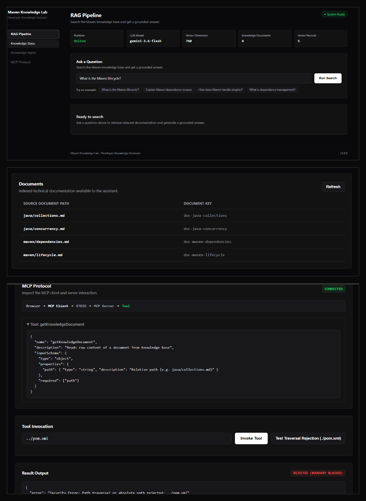

# Maven Knowledge Lab

Maven Knowledge Lab is a staged Java 17 learning system that demonstrates how a traditional Maven application can evolve into a knowledge retrieval, RAG, agent, servlet, and MCP-based developer platform.

## Overview

Maven Knowledge Lab was created as an engineering laboratory to demonstrate AI system components built on standard Java 17 foundation libraries without heavy third-party framework abstraction layers. The system implements document ingestion, deterministic chunking, vector embeddings, similarity search, Retrieval-Augmented Generation (RAG), a Jakarta Servlet web interface, an autonomous knowledge agent, and a Model Context Protocol (MCP) server.

The project emphasizes clean architecture, low dependency overhead, explicit component boundaries, and production-oriented security and configuration practices.




## What It Demonstrates

### Maven and Build Engineering
- Structured Maven multi-phase build configuration (`pom.xml`)
- Lifecycle management from compile to packaging (`war`)
- Dependency management using JUnit 5, Jackson, and Jakarta Servlet API
- Maven Wrapper (`mvnw`, `mvnw.cmd`) for reproducible builds across environments

### Knowledge Ingestion
- Markdown document loading and structural parsing from local repository storage
- Deterministic text chunking with configurable window size and overlap
- SHA-256 content hashing for chunk identity verification and deduplication

### Embeddings
- Provider abstraction (`EmbeddingProvider`) enabling interchangeable backends
- `GeminiEmbeddingProvider` integrating Google REST API (`gemini-embedding-001`)
- `DummyEmbeddingProvider` generating deterministic vectors for offline unit testing
- 768-dimensional normalized vector representations

### Vector Retrieval
- Custom file-backed vector storage (`FileVectorStore`) supporting append-only binary persistence
- Exact cosine similarity calculation and deterministic top-K ranking
- Configurable minimum similarity threshold filtering

### RAG
- End-to-end Retrieval-Augmented Generation pipeline (`RagService`)
- Context assembly and prompt construction (`PromptBuilder`)
- Integration with Google Gemini REST Interactions API (`gemini-3.6-flash`)
- Structured attribution with source document references and score metadata

### Web Layer
- Lightweight Jakarta Servlet implementation running on Apache Tomcat 10+
- REST API endpoints for system health, knowledge retrieval, RAG generation, and agent execution
- Embedded developer observability console providing live system metrics and debugging panels

### Knowledge Agent
- Bounded execution loop (`KnowledgeAgent`) with configurable step limits
- Controlled tool registry (`AgentToolRegistry`) with strict tool allowlisting
- Structured decision parsing (`GeminiAgentDecisionProvider`) generating JSON decision payloads

### MCP
- Model Context Protocol laboratory implementation (`McpKnowledgeServer`)
- Standard input/output (STDIO) transport protocol
- Protocol tool discovery (`tools/list`) and execution (`tools/call`)
- Path traversal protection ensuring access is strictly restricted to valid knowledge documents

## Architecture

```
User / HTTP Client
  |
  v
Developer Console / Servlets (Tomcat)
  |
  +----------------------+----------------------+
  |                      |                      |
  v                      v                      v
RAG Pipeline        Knowledge Agent         MCP Server
  |                      |                      |
  v                      v                      v
Embedding Provider   Agent Decision Provider  Document Service
  |                      |                      |
  v                      v                      v
Vector Store         Tool Registry          Knowledge Corpus
  |                      |
  +----------+-----------+
             |
             v
      Knowledge Corpus
```

```
Browser Interface
  |
  v
Servlet Layer (DeveloperConsoleServlet, RagServlet, HealthServlet)
  |
  +--> RAG Service
  +--> Knowledge Agent
  +--> MCP Client Protocol Interface
              |
              v
       STDIO Transport
              |
              v
        MCP Server
              |
              v
      Knowledge Repository
```

## Project Structure

```
maven-knowledge-lab/
├── .mvn/
│   └── wrapper/
├── knowledge/
│   ├── java/
│   │   ├── collections.md
│   │   └── concurrency.md
│   └── maven/
│       ├── dependencies.md
│       └── lifecycle.md
├── src/
│   ├── main/
│   │   ├── java/com/shevay/knowledge/
│   │   │   ├── agent/
│   │   │   ├── config/
│   │   │   ├── document/
│   │   │   ├── embedding/
│   │   │   ├── generation/
│   │   │   ├── mcp/
│   │   │   ├── model/
│   │   │   ├── retrieval/
│   │   │   ├── vector/
│   │   │   └── web/
│   │   └── webapp/
│   │       ├── WEB-INF/
│   │       │   └── web.xml
│   │       └── index.html
│   └── test/
│       └── java/com/shevay/knowledge/
├── .gitignore
├── mvnw
├── mvnw.cmd
├── pom.xml
└── README.md
```

## Technology Stack

| Technology | Purpose |
| :--- | :--- |
| Java 17 | Core programming language runtime |
| Maven / Maven Wrapper | Build automation, dependency resolution, packaging |
| Jakarta Servlet 6.0 | Web layer specification for servlet container integration |
| Apache Tomcat 10.1+ | Servlet web server host environment |
| Jackson Databind | JSON serialization and parsing |
| JUnit 5 | Automated unit and integration testing framework |
| Gemini REST API | Remote vector embedding (`gemini-embedding-001`) and generation (`gemini-3.6-flash`) |

*Note: Vendor SDKs (such as Google Cloud SDKs) are intentionally avoided. Remote interactions are implemented directly using native Java 17 `HttpClient` and REST JSON payloads.*

## Knowledge Pipeline

```
Document File (.md)
  → Read & Load (DocumentLoader)
  → Normalize & Hash (DocumentIngestionService)
  → Structural Chunking (TextChunker)
  → Vector Embedding (GeminiEmbeddingProvider)
  → Binary Store (FileVectorStore)
  → Cosine Similarity Search (SimilaritySearchService)
  → Context Assembly (ContextAssembler)
  → LLM Prompt Generation (GeminiGenerationProvider)
```

## Agent Model

The Knowledge Agent operates as a controlled orchestrator over registered application capabilities.

```
User Query
  → Prompt Construction
  → Decision Generation (GeminiAgentDecisionProvider)
  → Decision Validation (Tool Call vs Final Answer)
  → Execution (AgentToolRegistry)
  → Result Append to Context History
  → Iterative Loop (up to max iterations)
  → Final Answer Response
```

- **Bounded Execution**: Loop terminates automatically when a `final_answer` decision is produced or maximum allowed steps (default: 5) are reached.
- **Allowlisted Tools**: Agent can only invoke tools explicitly defined in `AgentToolRegistry` (`getKnowledgeDocument`, `searchKnowledgeBase`).
- **Safety Controls**: Arbitrary shell execution, filesystem navigation outside designated root, and network scanning are completely blocked by design.

## MCP Model

The Model Context Protocol implementation provides a standardized interface for discovery and execution of knowledge base utilities over standard input/output (STDIO).

```
MCP Client Request
  → STDIO Transport Interface
  → Protocol Parser (JSON-RPC tool format)
  → McpKnowledgeServer Execution
  → Document Retrieval & Traversal Verification
  → JSON Response Formatting
```

Phase 8 uses an isolated STDIO-based protocol implementation designed for local process integration. HTTP transport and external network listeners are intentionally excluded.

## Running the Project

### Build and Test

Execute automated unit tests:

```cmd
.\mvnw.cmd clean test
```

Package application artifact (WAR archive):

```cmd
.\mvnw.cmd package
```

The compiled web artifact will be generated at `target/maven-knowledge-lab-1.0-SNAPSHOT.war`.

### Running via CLI Mode

The application includes a main entry point for CLI experimentation:

```cmd
java -cp target/classes com.shevay.knowledge.Application
```

### Web Deployment

To deploy to Tomcat 10.1+:

1. Build the WAR archive (`.\mvnw.cmd package`).
2. Copy `target/maven-knowledge-lab-1.0-SNAPSHOT.war` into Tomcat's `webapps` directory.
3. Start Tomcat (`bin/catalina.bat run`).
4. Access the Developer Console at `http://localhost:8080/maven-knowledge-lab-1.0-SNAPSHOT/`.

## Configuration

Configuration parameters are loaded via `AppConfig`. The Google Gemini API key resolution follows a strict priority order:

1. System property: `gemini.api.key` (e.g., `-Dgemini.api.key=YOUR_KEY`)
2. Environment variable: `GEMINI_API_KEY`

```cmd
set GEMINI_API_KEY=YOUR_GEMINI_API_KEY
```

Default runtime settings:

| Setting | Default Value | Description |
| :--- | :--- | :--- |
| `embedding.provider` | `gemini` | Embedding backend provider (`gemini` or `dummy`) |
| `embedding.model` | `gemini-embedding-001` | Embedding model identifier |
| `embedding.dimensions` | `768` | Vector dimensionality |
| `generation.provider` | `gemini` | Text generation backend provider (`gemini` or `dummy`) |
| `generation.model` | `gemini-3.6-flash` | Text generation model identifier |
| `retrieval.top.k` | `3` | Maximum retrieved context chunks |
| `retrieval.min.score` | `0.70` | Minimum cosine similarity threshold |

## HTTP API

The web application exposes standard REST JSON endpoints:

### Health Check

- **Method**: `GET`
- **Path**: `/api/health`
- **Response**: `200 OK`
  ```json
  {
    "status": "UP",
    "timestamp": "2026-09-04T07:14:00Z",
    "version": "1.0-SNAPSHOT"
  }
  ```

### RAG Query

- **Method**: `POST`
- **Path**: `/api/rag/query`
- **Request Body**:
  ```json
  {
    "query": "What is the Maven lifecycle?"
  }
  ```
- **Response Body**:
  ```json
  {
    "query": "What is the Maven lifecycle?",
    "answer": "...",
    "retrievedChunks": [
      {
        "documentPath": "maven/lifecycle.md",
        "similarityScore": 0.85,
        "contentSnippet": "..."
      }
    ]
  }
  ```

## Testing

The repository contains an automated regression suite built on JUnit 5.

- **Total Tests**: 95 executed in default test suite (160 across all unit and mock integration test classes)
- **Failures**: 0
- **Errors**: 0
- **Skipped**: 1 (Opt-in live external integration test requiring API quota)

Test coverage includes configuration parsing, document chunking, SHA-256 identity verification, vector store binary serialization, cosine similarity calculations, RAG context assembly, Servlet HTTP handling, agent decision processing, and MCP protocol handling.

## Security Considerations

- **Credential Management**: API keys are supplied strictly via environment variables or system properties. Secrets are never logged, stored in source files, or serialized into exceptions.
- **HTTP Header Authentication**: Gemini API requests use the official `x-goog-api-key` header rather than URL query parameter authentication.
- **Path Traversal Protection**: File loading utilities and MCP tool implementations reject relative path escapes (e.g., `../`, `..\`) and enforce root directory validation.
- **Execution Scoping**: The knowledge agent is restricted to an explicit tool registry and cannot execute system processes or mutate files.

## Limitations

- **Linear Vector Search**: `FileVectorStore` performs exact linear scans (`O(N)`) over persistent vector records. It is designed for learning and small-scale corpora, not large-scale production vector indexing.
- **STDIO Transport Scope**: The MCP implementation is strictly STDIO-based and does not support HTTP/SSE transports.
- **External API Rate Limits**: Remote embedding and generation features rely on external Google Gemini REST endpoints, which are subject to free-tier rate limits (429 RESOURCE_EXHAUSTED).
- **Index Rebuilding**: Changing embedding models or dimensionality requires rebuilding the binary `data/vectors.dat` store.

## Design Decisions

- **Direct Java HttpClient**: Native HTTP capabilities eliminate third-party SDK dependencies, reducing build artifact size and maintenance footprint.
- **Binary File Storage**: Storing vector records in a simple binary format (`FileVectorStore`) provides clear visibility into serialization mechanics without requiring external database instances.
- **Modular Component Isolation**: Domain logic (chunking, retrieval, generation) is completely decoupled from web servlets, allowing identical components to power CLI, Servlet, and MCP interfaces.

## Learning Progression

- **Phase 1 — Foundation**: Project structure, configuration management, and domain models.
- **Phase 2 — Document Ingestion**: Document loading, normalization, SHA-256 hashing, and text chunking.
- **Phase 3 — Embedding Provider**: Embedding interface and Google Gemini REST provider (`gemini-embedding-001`).
- **Phase 4 — Vector Store & Retrieval**: Binary vector storage and cosine similarity retrieval.
- **Phase 5 — RAG Generation**: Context assembly, prompt engineering, and LLM text generation (`gemini-3.6-flash`).
- **Phase 6 — Servlet Web Interface**: Jakarta Servlet endpoints and embedded developer console.
- **Phase 7 — Knowledge Agent**: Autonomous agent decision loop with structured tool usage.
- **Phase 8 — MCP Protocol Lab**: Model Context Protocol implementation for tool discovery and execution.

Phase 8 is the final planned phase of Maven Knowledge Lab.

## Future Work

This repository is intentionally frozen after Phase 8. Future experiments such as PostgreSQL/pgvector, approximate nearest-neighbor indexing, or additional MCP transports belong in separate learning projects rather than expanding this laboratory.

## Status

Status: Complete / Frozen
